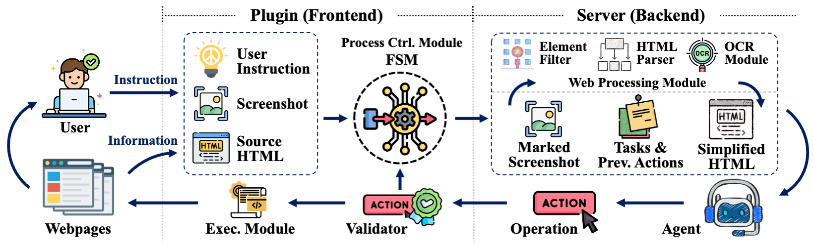

# OpenWebAgent: An Open Toolkit to Enable Web Agents on Large Language Models


## Overview



OpenWebAgent is an open toolkit that enables model-based web agents to streamline human-computer interactions by automating tasks on webpages. We provide the plugin and server source code so that users can easily add their own models to the backend to get a usable web browsing agent.

## Features

- **High-Performance HTML Parser**: This parser simplifies complex HTML for OpenWebAgent, boosting document processing speed and accuracy.
- **Unique Interaction Workflow**: Integrating user intent, action history, and parsed HTML, this modular workflow ensures coherent actions and easy model integration.
- **Streamlined User Interface**: Ready to use instantly, users can track processes and control tasks with just a few buttons, no complex setup needed.

## Usage

In fact, our plugin is ready-to-use, you can download `extension.zip` and unzip it to add it to your Chrome browser for use. Don't forget to follow the instructions below to set up your own server to handle requests.

### Plugin

1. If you want to modify the source code of the plugin, please download the requirements first:

   ```sh
   cd plugin
   npm install
   ```

2. Then, use the following command to create the extension, after which you should see a folder `openwebagent-extension`, which you can install as an unpacked plugin to Chrome.

   ```
   npm run build
   ```

3. For more informations, please refer to the `README.md` in `plugin/README.md`.

### Server

1. First, you need to set up `config/server_config.yaml`. For other models, see `server/README.md` for more details.

   ```yaml
   planner_args:
     provider: "openai"
     model: "gpt-4-turbo-2024-04-09"
     n_workers: 2
   ```

2. Configure your MongoDB Atlas, you can also save the data locally, but remember to update `config/mongo_config.yaml` to the configuration you are using.

   ```yaml
   mongo_args:
     base_url: "<your-url>"
     dbname: "<your-db-name>"
     username: "<your-username>"
   ```

3. Then, add your own api key in `.env`.

   ```yaml
   OPENAI_KEY="<your-token>"
   LOG_DB_PASSWD="<your-db-password>"
   OPENAI_API_URL="<your-openai-url>"  # optional
   ```

4. Download the required packages.

   ```bash
   cd server
   bash setup.sh
   ```

5. Start the server and enjoy your own web agent now!

   ```shell
   python agent/run_server.py
   ```

6. For more informations, please refer to the `README.md` in `server/README.md`.

## Citation
If you find our code or plugin useful, please consider citing our paper.

```
@inproceedings{iong2024openwebagent,
    title     = {OpenWebAgent: An Open Toolkit to Enable Web Agents on Large Language Models},
    author    = {Iat Long Iong and Xiao Liu and Yuxuan Chen and Hanyu Lai and Shuntian Yao and Pengbo Shen and Hao Yu and Yuxiao Dong and Jie Tang},
    booktitle = {ACL 2024 System Demonstration Track},
    year      = {2024}
}
```
